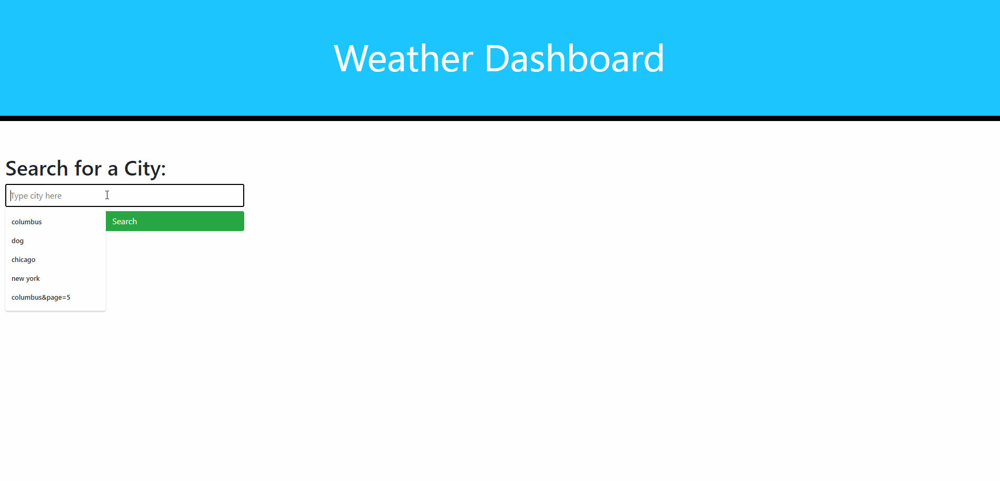

# Weather Dashboard
Created by Shawn Miller

# Description
This website was made to give a user a way to search a city and find the current weather of that city which includes the date, weather forecast icon with description, current temperature, wind speed, Humidity and UV index by number and color depending on the level of severity.  Below the current weather the user will find a five day forecast that will show weather forecast icon with description, temperature, wind speed humidity for each of the five days.  All  searches the user creates will save to local storage and create a button below the search bar.  When a user clicks on the previous city search button the weather for that city will display again.  There is also an included clear history button to remove all previous searches.

# Technologies Used
- HTML
- CSS
- Javascript
- Jquery
- Bootstrap
- FontAwesome
- moment().js
- API

# Appearance

# Known Bugs
No known bugs

## Contact info
shawnsmm@gmail.com